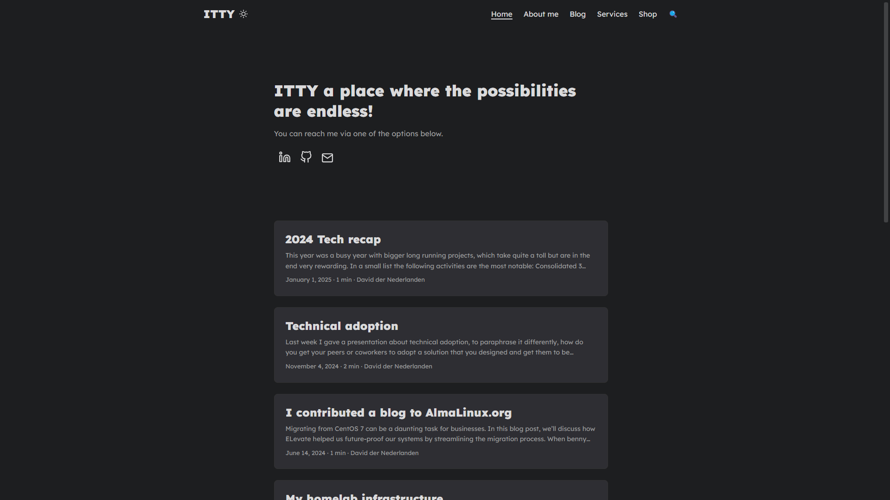

# itty.nl website

This repository contains website source code for https://itty.nl.

This website is built with the [Hugo](https://gohugo.io/) web framework.

### Reporting a Bug

Good bug reports can be very helpful. A bug is a demonstrable problem with the code or functionality.

Please use the [GitHub issues](https://github.com/randommen96/itty.nl/issues) and check if the issue has already been reported. A good bug report should be as detailed as possible, so that others won't have to follow up for the essential details.

### Requesting a Feature

1. [Search the issues](https://github.com/randommen96/itty.nl/issues) for any open requests for the same feature, and give a thumbs up or +1 on existing requests.
1. If no previous requests exist, create a new issue. Please be as clear as possible about why the feature is needed and the intended use case.
